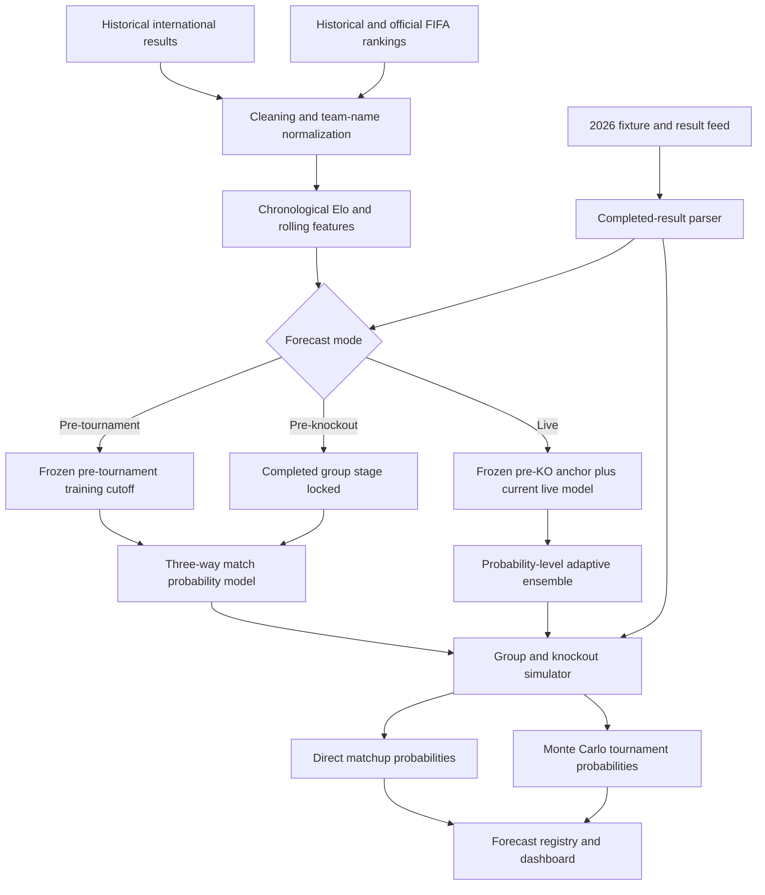

# World Cup Prediction Engine: Technical Methodology

This document is the technical specification for the forecasting pipeline in this repository. It describes what the system predicts, how data is transformed, how models are trained and evaluated, how the live model adapts during the knockout stage, how tournament Monte Carlo simulation works, and what the reported probabilities do and do not mean.

The implementation remains the source of truth. The most relevant files are:

- [`configs/model_config.yaml`](../configs/model_config.yaml): model, feature, and selection configuration.
- [`configs/tournament_2026.yaml`](../configs/tournament_2026.yaml): tournament structure, live-update weighting, and simulation profiles.
- [`src/worldcup_prediction/features.py`](../src/worldcup_prediction/features.py): target and feature construction.
- [`src/worldcup_prediction/elo.py`](../src/worldcup_prediction/elo.py): chronological Elo updates.
- [`src/worldcup_prediction/models.py`](../src/worldcup_prediction/models.py): model factories, fitting, and probability output.
- [`src/worldcup_prediction/pipeline.py`](../src/worldcup_prediction/pipeline.py): end-to-end orchestration and forecast modes.
- [`src/worldcup_prediction/simulator.py`](../src/worldcup_prediction/simulator.py): group, knockout, and Monte Carlo logic.
- [`src/worldcup_prediction/live_update_backtest.py`](../src/worldcup_prediction/live_update_backtest.py): historical live-weight evaluation.
- [`app/streamlit_app.py`](../app/streamlit_app.py): dashboard semantics and round-specific evaluation.

## 1. Scope and prediction contract

The system solves two related but distinct problems:

1. **Match outcome prediction:** estimate three pre-match probabilities for a fixture:
   - `P(team A loses)`
   - `P(draw)`
   - `P(team A wins)`
2. **Tournament forecasting:** propagate those match probabilities through the official group and knockout structure to estimate qualification, round-reach, finalist, and champion probabilities.

The primary match model is a three-class model. The class encoding is:

| Target | Meaning |
| ---: | --- |
| `0` | Team A loses |
| `1` | Draw |
| `2` | Team A wins |

For knockout simulation, a second probability is derived from the three-way output:

```text
P(team A advances) = P(team A wins) + 0.5 * P(draw)
P(team B advances) = 1 - P(team A advances)
```

This is an explicit modeling assumption: if regulation/recorded match outcome is a draw, each team receives half of the draw mass. The current model does **not** estimate team-specific extra-time or shootout skill.

### 1.1 What the system does not claim

The project does not currently claim to provide:

- a minute-by-minute in-play model;
- a fitted expected-goals model for the primary `ml_outcome` path;
- a player, injury, lineup, weather, travel, or market-odds model;
- a dedicated extra-time or penalty-shootout probability model;
- a universal football prediction record;
- a causal estimate of why a team wins;
- a full Bayesian posterior over all model parameters.

The primary output is a probabilistic forecast. A correct top pick does not prove that its probability was well calibrated, and a wrong top pick does not by itself prove that the probability estimate was poor.

## 2. End-to-end architecture



The design intentionally separates the match model from the tournament simulator. Historical World Cups provide enough matches to evaluate a match-level model, but far too few tournament winners to train a reliable direct "champion classifier."

## 3. Terminology

| Term | Definition in this repository |
| --- | --- |
| Team A / Team B | Canonical fixture orientation used by the feature table and probability vector. It should not be interpreted as home/away for neutral World Cup matches. |
| Three-way or 1X2 probability | Team A loss, draw, and Team A win probability before the match. |
| Advance probability | Binary probability of reaching the next knockout round after allocating draw mass 50/50. |
| Direct probability | Model probability evaluated once for a known, fixed matchup. |
| Monte Carlo frequency | Fraction of relevant simulation trials producing an event. |
| Slot probability | Probability that a team occupies a bracket slot; it is not necessarily its chance to win the match. |
| Frozen anchor | Model, Elo, ranking, and form state fixed at the post-group-stage/pre-knockout cutoff. |
| Live model | Model and state rebuilt using all completed information available at the live cutoff. |
| Adaptive ensemble | Probability-level blend of the frozen anchor and live model. |
| Snapshot | Versioned forecast artifact generated with an explicit cutoff, mode, config, and git commit. |
| Locked result | Completed real result inserted into every simulation instead of being sampled. |

## 4. Data lineage

### 4.1 Sources

The downloader currently uses:

| Dataset | Source | Purpose |
| --- | --- | --- |
| International match results | [`martj42/international_results`](https://github.com/martj42/international_results) | Historical model training, Elo, form, and backtests. |
| Historical FIFA rankings | [`Dato-Futbol/fifa-ranking`](https://github.com/Dato-Futbol/fifa-ranking) | Historical pre-match rank and ranking-points features. |
| Latest ranking snapshot | [Official FIFA ranking page and API](https://inside.fifa.com/fifa-world-ranking/men) | Latest available 2026 ranking state. |
| 2026 tournament fixtures/results | [`openfootball/worldcup.json`](https://github.com/openfootball/worldcup.json) | Groups, completed scores, extra time, penalties, participants, and schedule. |
| Historical knockout archive | Local normalized CSV generated from OpenFootball World Cup archives | Round-by-round live-weight backtesting for 2002-2022. |
| Third-place mapping | [`data/external/fwc2026_third_place_annex_c.csv`](../data/external/fwc2026_third_place_annex_c.csv) | Official best-third-place Round-of-32 assignment. |

Source availability does not guarantee immediate freshness. A live run can only incorporate a completed result after the upstream feed publishes it.

### 4.2 Historical match schema

The expected raw historical result columns are:

```text
date, home_team, away_team, home_score, away_score,
tournament, city, country, neutral
```

Cleaning converts the orientation to:

```text
date, team_a, team_b, team_a_score, team_b_score,
tournament, neutral, stage, group
```

Rows with missing or invalid scores are rejected from the completed-match training table. Duplicate normalized fixtures are removed using date, teams, score, and tournament identity.

### 4.3 FIFA ranking schema

The normalized ranking table is:

```text
rank_date, team, rank, points
```

Historical points are ranked within each publication date. The latest official snapshot can be appended to the historical feed. Duplicate `(rank_date, team)` rows keep the latest normalized source row.

### 4.4 Team-name normalization

Aliases such as `USA`, `United States of America`, and `IR Iran` are mapped through [`data/external/team_mapping.csv`](../data/external/team_mapping.csv). The same normalization is applied to historical matches, rankings, live fixtures, winners, and historical knockout archives.

This mapping is operationally important. A naming mismatch can make a strong team appear to have no Elo, ranking, or form history and therefore fall back to imputed/default values.

### 4.5 2026 score fields and winner precedence

The fixture parser retains separate fields:

```text
team_a_score_ft, team_b_score_ft
team_a_score_et, team_b_score_et
team_a_penalties, team_b_penalties
winner, winner_method
```

For the displayed final score:

1. use extra-time score when both extra-time values exist;
2. otherwise use full-time score.

For the team that advances:

1. use penalty score when a shootout is present and decisive;
2. otherwise use the decisive final/extra-time score;
3. otherwise use an explicit winner from the fixture feed;
4. as a defensive fallback, infer the prior-round winner when exactly one prior participant appears in the next round.

The fallback is used only to repair a missing winner field that is logically implied by the bracket. It does not invent a participant outside the actual bracket path.

## 5. Time boundaries and leakage prevention

Temporal correctness is a core design requirement.

### 5.1 Historical features

For a match on date `t`:

- Elo features are recorded before applying the result at `t`.
- Rolling form is calculated from each team's prior matches, then the current result is appended to history.
- FIFA ranking lookup uses the latest ranking strictly before `t` during historical feature construction.
- Rest days use the last match date observed before `t`.

### 5.2 World Cup backtest split

For each World Cup window:

```text
training rows: date < tournament start
test rows: tournament start <= date <= tournament end
           and tournament == FIFA World Cup
```

The code asserts that the maximum training date is earlier than the minimum test date. Random train/test splitting is deliberately not used.

### 5.3 2026 ranking cutoff

The tournament config sets:

```yaml
data_cutoff: "2026-06-11"
ranking_cutoff_inclusive: true
```

This permits the official same-day ranking snapshot for tournament prediction while match training remains strict-before the match/tournament cutoff. The forecast registry records the effective cutoff so this choice remains auditable.

### 5.4 Round-specific live evaluation

A completed round must be evaluated against a snapshot created before that round started. The dashboard follows this rule:

- Round of 32 uses the pre-knockout snapshot.
- Round of 16 uses the latest valid live snapshot produced after Round of 32 and before Round of 16.
- Quarterfinals use the snapshot after Round of 16 and before the quarterfinals.
- Semifinals and final follow the same pattern.

If an original snapshot is missing, the pipeline can reconstruct one from the archived fixture feed using only rows and results that would have been known at the requested cutoff. Reconstructed snapshots are labeled as reconstructed; they are not presented as timestamped original forecasts.

## 6. Target construction

For each training row:

```text
target = 0 if team_a_score < team_b_score
target = 1 if team_a_score == team_b_score
target = 2 if team_a_score > team_b_score
```

The primary model therefore learns a three-way score-result target. In a live knockout match decided by penalties, the score can remain a draw for model training while the actual advancing team is stored separately for bracket locking and advance-accuracy evaluation.

This distinction is intentional:

- the 1X2 target describes the recorded match score outcome;
- the knockout winner describes tournament progression;
- shootout scores do not get added to football goals;
- the current feature model does not learn a separate `penalty_strength` variable.

## 7. Elo model

Every team starts at an Elo rating of `1500` unless prior chronological results have updated it.

### 7.1 Expected result

For Team A and Team B ratings `R_A` and `R_B`:

```text
E_A = 1 / (1 + 10 ^ ((R_B - R_A) / 400))
```

The observed score is:

```text
S_A = 1.0 for a win
S_A = 0.5 for a draw
S_A = 0.0 for a loss
```

The update is:

```text
delta = K * (S_A - E_A)
R_A_new = R_A + delta
R_B_new = R_B - delta
```

### 7.2 K factors

| Match context | K |
| --- | ---: |
| Friendly | 20 |
| Qualification / qualifier | 30 |
| Other international match | 30 |
| Euro, Copa, AFCON, Asian Cup, Gold Cup | 40 |
| World Cup group/unspecified stage | 50 |
| World Cup knockout, round, quarterfinal, semifinal | 60 |
| World Cup final | 70 |

The final check deliberately distinguishes `final` from `semifinal` and `quarterfinal` tokens.

### 7.3 Elo features

The trained model receives:

| Feature | Definition |
| --- | --- |
| `elo_diff` | `R_A - R_B` |
| `elo_abs_diff` | `abs(R_A - R_B)` |
| `elo_expected_a` | Logistic Elo expectation `E_A` |

`elo_abs_diff` allows the classifier to learn behavior associated with mismatch size that is not purely directional.

## 8. Feature engineering

The active baseline feature list contains 16 columns.

### 8.1 Strength and ranking

| Feature | Definition and sign |
| --- | --- |
| `elo_diff` | Positive when Team A has higher Elo. |
| `elo_abs_diff` | Absolute Elo gap. |
| `elo_expected_a` | Elo expected score for Team A. |
| `fifa_rank_diff` | `rank_B - rank_A`; positive favors Team A because lower numeric rank is better. |
| `fifa_points_diff` | `points_A - points_B`; positive favors Team A. |

### 8.2 Rolling form

For each team, the pipeline stores prior match outcomes before adding the current match. Points are `3/1/0`, and goal difference is goals for minus goals against.

| Feature | Definition |
| --- | --- |
| `form_points_diff_5` | Team A prior-five points per game minus Team B prior-five points per game. |
| `form_points_diff_10` | Same calculation over the prior ten matches. |
| `goal_diff_form_10` | Difference in average goal difference over the prior ten matches. |

The feature builder also computes additional 5/10/20-match summaries, but only configured columns enter the primary model.

### 8.3 Context

| Feature | Values |
| --- | --- |
| `is_neutral` | `1` for neutral venue. |
| `team_a_home_advantage` | `1` only when the match is not neutral. |
| `is_friendly` | Tournament-name indicator. |
| `is_qualifier` | Qualification-name indicator. |
| `is_world_cup` | `1` for FIFA World Cup. |
| `is_world_cup_group` | `1` for World Cup group stage. |
| `is_world_cup_knockout` | `1` for round/quarter/semi/final/knockout stages. |
| `rest_days_diff` | Team A days since prior match minus Team B days since prior match. |

For future simulated World Cup fixtures, venue is treated as neutral, Team A has no home advantage, and `rest_days_diff` is currently set to `0`. Therefore, historical rest is a trained feature but future schedule-specific rest asymmetry is not yet modeled.

### 8.4 Missing values

The primary sklearn pipeline applies median imputation fitted on the training data. Logistic candidates then standardize numeric features with `StandardScaler` before classification.

Missing values are not treated as zeros. However, a team with sparse history may still depend heavily on training-set medians and its available Elo/ranking evidence.

## 9. Primary machine-learning model

The configured primary model is:

```yaml
primary_model: logistic_plain_c0_5
primary_metric: log_loss
```

Its effective sklearn pipeline is:

```text
SimpleImputer(strategy="median")
-> StandardScaler()
-> LogisticRegression(
       C=0.5,
       class_weight=None,
       max_iter=1000,
       random_state=42
   )
```

This is multinomial probabilistic classification through sklearn's supported multiclass behavior. Conceptually, for class `k`:

```text
P(y = k | x) = exp(beta_k^T x) / sum_j exp(beta_j^T x)
```

`C=0.5` means stronger L2 regularization than the default `C=1.0`. The goal is to limit unstable coefficients and overconfident probabilities.

### 9.1 Candidate models

Configured logistic backtest candidates include:

- unweighted logistic regression with `C=0.5`, `1.0`, and `2.0`;
- balanced logistic regression with `C=0.5`, `1.0`, and `2.0`.

Optional experiment factories also exist for:

- random forest;
- histogram gradient boosting;
- XGBoost when the optional dependency is installed.

Heavier candidates are not part of every default refresh because live operational runs should remain reproducible and reasonably fast.

### 9.2 Why logistic regression is the current primary model

The model was selected on rolling World Cup log loss, not on a single 2026 result or one tournament's top-pick accuracy. Logistic regression also provides:

- stable probability output on a modest feature set;
- regularization that is easy to audit;
- deterministic training under the configured seed;
- less small-sample flexibility than high-capacity tree ensembles;
- coefficients and feature direction that can be inspected.

This does not imply logistic regression is universally superior. It means it is the current conservative choice under this repository's time-aware evaluation.

## 10. Historical validation

### 10.1 Rolling windows

The test windows are the FIFA World Cups of:

```text
2002, 2006, 2010, 2014, 2018, 2022
```

Each model is refit using only matches before that World Cup. The tournament itself is then used as an untouched chronological test window.

### 10.2 Evaluation metrics

Let `y_ik` be one-hot truth and `p_ik` the predicted probability for observation `i`, class `k`.

**Accuracy / top-1 accuracy**

```text
mean(argmax_k p_ik == y_i)
```

**Multiclass log loss**

```text
-mean(sum_k y_ik * log(p_ik))
```

Lower is better. It strongly penalizes confident probability assigned to the wrong class.

**Multiclass Brier score**

```text
mean(sum_k (p_ik - y_ik)^2)
```

Lower is better. It measures squared probability error.

**Ranked Probability Score (RPS)**

The three ordered outcomes are accumulated and squared at each non-terminal boundary:

```text
mean(sum_{k < K} (CDF_prediction(k) - CDF_truth(k))^2 / (K - 1))
```

RPS recognizes that a predicted draw is ordinally closer to a win than a loss is.

### 10.3 Baseline results

The generated rolling summary currently reports:

| Model | Mean accuracy | Mean log loss | Mean Brier | Mean RPS |
| --- | ---: | ---: | ---: | ---: |
| Full primary ML | 55.99% | 0.9727 | 0.5728 | 0.1990 |
| Elo Poisson | 55.99% | 0.9853 | 0.5807 | 0.2027 |
| Elo probability | 55.99% | 0.9921 | 0.5885 | 0.2058 |
| Elo-only logistic | 52.60% | 1.0115 | 0.5990 | 0.2117 |
| FIFA-only logistic | 49.48% | 1.0139 | 0.6061 | 0.2147 |
| Uniform random | 33.59% | 1.0986 | 0.6667 | 0.2396 |

The defensible interpretation is that the primary model improves probability quality relative to the strong Elo baselines while producing similar mean top-pick accuracy. It is not a large headline accuracy improvement over Elo.

### 10.4 Calibration and sharpness

Across the six rolling World Cups (`384` predictions), the current generated diagnostics report approximately:

```text
top-1 accuracy:                 55.99%
mean maximum probability:      54.92%
expected calibration error:     3.12 percentage points
mean predictive entropy:        0.9684
```

Calibration bins are descriptive and sample sizes can be small. The model card explicitly identifies the base probabilities as uncalibrated; calibration diagnostics are reported separately rather than silently applying an unversioned correction.

### 10.5 Nested selection

The nested model-selection report chooses a candidate using only earlier World Cup windows, then evaluates it on the next outer World Cup. This avoids selecting a model on the same window used to report its performance.

### 10.6 Ablation tests

Ablation outputs compare:

- Elo only;
- FIFA only;
- form only;
- context only;
- the full feature set;
- full minus each major feature family.

Ablation is used to diagnose contribution, not to claim causal importance. Correlated feature groups can substitute for one another.

## 11. Forecast modes

The dashboard and pipeline expose three forecast modes.

### 11.1 Pre-tournament

Purpose: preserve what the system expected before tournament results were incorporated.

Behavior:

- no 2026 result is locked into group standings or knockout paths;
- model training is bounded by the configured pre-tournament cutoff;
- every group and knockout match is simulated;
- outputs use base filenames without `_live` or `_pre_knockout`;
- this snapshot is used to evaluate predicted group qualifiers and exact top-two positions.

A snapshot regenerated after kickoff is a cutoff-based reconstruction unless the original data and commit were preserved before kickoff.

### 11.2 Pre-knockout

Purpose: freeze the tournament state after all group-stage matches and before the Round of 32.

Behavior:

- all expected group matches must be completed;
- actual group results and final group table are locked;
- group-stage 2026 results may update training history, Elo, and form;
- the cutoff is the day after the last completed group match;
- no knockout result is allowed into this snapshot;
- this snapshot becomes the Round-of-32 forecast baseline;
- outputs use `_pre_knockout` filenames.

This mode separates two questions:

1. How accurate was the pre-tournament forecast about teams and exact group positions?
2. Given the real completed group stage, what did the model predict for the knockout bracket?

### 11.3 Live

Purpose: forecast the remaining tournament using every completed result available at refresh time without rewriting earlier round predictions.

Behavior:

- completed group and knockout matches are parsed and locked;
- the live cutoff is one day after the latest completed fixture date;
- the live model is rebuilt with completed 2026 data through that cutoff;
- a frozen pre-knockout anchor remains unchanged;
- live and anchor probabilities are blended with a controlled round-dependent weight;
- only unplayed outcomes are simulated;
- outputs use `_live` filenames.

The dashboard evaluates completed rounds against their saved pre-round snapshots, not against the latest model after the result is already known.

## 12. Adaptive live ensemble

### 12.1 Architecture

The live forecaster contains two complete probability predictors:

1. **Frozen pre-knockout anchor**
   - training rows end at the pre-knockout cutoff;
   - Elo is frozen at that cutoff;
   - FIFA ranking snapshot is frozen at that cutoff;
   - rolling form is frozen at that cutoff.
2. **Current live model**
   - training rows include completed group and knockout results available at the current cutoff;
   - Elo and form are recomputed through the live cutoff;
   - ranking uses the latest eligible snapshot;
   - the same feature schema and logistic model family are used.

The frozen anchor prevents a small number of knockout matches from dominating decades of historical evidence. The live model permits adaptation to current tournament evidence.

### 12.2 Weight formula

For `n` completed knockout matches:

```text
raw_live_weight(n) = n / (n + prior_strength)
live_weight(n) = min(max_live_weight, raw_live_weight(n))
anchor_weight(n) = 1 - live_weight(n)
```

Current configuration:

```text
prior_strength = 80
max_live_weight = 0.35
```

The probability blend is applied independently to each 1X2 class:

```text
P_final(class) = anchor_weight * P_anchor(class)
               + live_weight   * P_live(class)
```

Because both input vectors are normalized and the weights sum to one, the blended vector also sums to one.

### 12.3 Effective round-start weights

For a 32-team knockout stage:

| Forecast round | Prior completed KO matches | Live weight | Anchor weight |
| --- | ---: | ---: | ---: |
| Round of 32 | 0 | 0.00% | 100.00% |
| Round of 16 | 16 | 16.67% | 83.33% |
| Quarterfinals | 24 | 23.08% | 76.92% |
| Semifinals | 28 | 25.93% | 74.07% |
| Final | 30 | 27.27% | 72.73% |

The configured `35%` cap is not reached within this tournament because `30 / (30 + 80) = 27.27%`.

### 12.4 Is this fine-tuning, partial fit, or warm start?

The most precise name is:

> Frozen-anchor adaptive probability ensemble with round-wise refitting.

It can be described informally as lightweight tournament adaptation, but it is **not**:

- neural-network fine-tuning;
- sklearn `partial_fit`;
- coefficient warm starting;
- one model whose existing coefficients are incrementally nudged.

At refresh time, the anchor and live models are fitted as separate models on their respective chronological datasets. Their output probabilities are then blended. This is safer to explain and audit than calling it incremental coefficient training.

### 12.5 Historical live-weight backtest

The weight study uses decisive Round-of-16 through final ties from the 2002-2022 World Cups, excluding third-place matches. For each historical tournament:

1. build a frozen post-group-stage anchor;
2. predict the next knockout round;
3. add only earlier completed knockout rounds to the live dataset;
4. rebuild the live model at that historical cutoff;
5. evaluate candidate shrinkage settings on team-to-advance probability;
6. report advance accuracy, binary log loss, and binary Brier score.

The pooled table has `90` historical knockout ties. The `prior=80` candidates currently report approximately:

```text
advance accuracy:   66.67%
advance log loss:    0.5765
advance Brier:       0.1966
```

The pooled best log loss is marginally lower for `prior=120`, while the configured value remains `80`. The differences are very small, the historical sample is limited, and several caps never bind. Therefore `80` should be treated as a conservative operational choice, not a proven universal optimum.

A separate walk-forward selection procedure tunes only on earlier World Cups and evaluates the next one. Its current aggregate covers four holdout tournaments and 60 matches. It is useful evidence, but still too small for strong claims about a uniquely optimal weight.

## 13. Penalties and extra time

Penalty handling has three separate roles.

### 13.1 Result ingestion

Full-time, extra-time, and shootout scores are retained separately. The displayed final football score uses the extra-time score when present, while the shootout score is displayed as a separate penalty result.

### 13.2 Bracket progression

The actual shootout winner is used as the advancing team. This prevents a `1-1` or `0-0` football score from producing an unresolved knockout bracket.

### 13.3 Model training

The current 1X2 model does not use penalty score as a feature or convert shootout victory into a regulation win. A shootout match whose football score remains level contributes a draw target to the three-way model. Its advancing winner is used in the separate knockout evaluation.

This avoids treating shootout goals as ordinary goals, but it also means the model has no explicit team-specific shootout ability. A future penalty layer should be evaluated separately on historical knockout data and should not replace the 1X2 target.

## 14. Tournament simulation

### 14.1 Tournament configuration

The 2026 structure contains:

```text
12 groups x 4 teams
6 matches per group
72 group matches
24 top-two qualifiers
8 best third-place qualifiers
32-team knockout stage
31 knockout matches
```

The knockout match IDs and winner dependencies are configured explicitly rather than inferred by list order.

### 14.2 Group match simulation

For every unresolved group fixture:

1. obtain a three-way probability vector from the configured predictor;
2. sample win/draw/loss;
3. sample a compatible scoreline;
4. update points, goals for, goals against, goal difference, and wins.

Completed group fixtures bypass sampling and update the table with their actual scores in every trial.

### 14.3 Conditional scoreline templates

When `simulation_predictor: ml_outcome`, the primary model does not emit goal-rate parameters. The simulator therefore samples scorelines conditionally on the sampled outcome.

Draw templates:

| Score | Conditional probability |
| --- | ---: |
| 0-0 | 25% |
| 1-1 | 55% |
| 2-2 | 20% |

Team A win templates:

| Score | Conditional probability |
| --- | ---: |
| 1-0 | 30% |
| 2-0 | 20% |
| 2-1 | 30% |
| 3-1 | 12% |
| 3-2 | 8% |

Team B uses the mirrored score templates.

These templates preserve outcome consistency and provide goals for group tiebreakers. They are not a fitted team-specific score model. Consequently, goal-difference-driven group qualification has additional approximation error beyond the three-way match probabilities.

### 14.4 Elo Poisson alternative

The `elo_poisson` baseline maps Elo difference to a strength ratio:

```text
strength_ratio = 10 ^ ((R_A - R_B) / 400)
lambda_B = average_total_goals / (1 + strength_ratio)
lambda_A = average_total_goals - lambda_B
```

Independent Poisson score probabilities are enumerated from 0 to 10 goals and normalized into win/draw/loss probabilities. This remains a baseline, not the primary production predictor.

### 14.5 Group ranking

Within a group, ordering uses:

1. points;
2. goal difference;
3. goals for;
4. head-to-head points among teams tied on the first three criteria;
5. head-to-head goal difference;
6. head-to-head goals for;
7. wins;
8. seeded random draw as the final simulation fallback.

Best-third-place selection uses points, goal difference, goals for, and wins, then takes the configured top eight.

The random fallback represents unresolved competition rules not fully modeled in the available data. It should not be interpreted as a real disciplinary/fair-play forecast.

### 14.6 Round-of-32 assignment

Top-two slots are deterministic from group positions. Best-third-place slots use the configured official Annex C table based on the set of eight qualifying third-place groups. The table covers the permitted group combinations and maps each third-place team to a specific Round-of-32 match.

### 14.7 Knockout progression

For an unresolved knockout fixture:

```text
p_advance_A = P(A wins) + 0.5 * P(draw)
winner = A if Uniform(0,1) < p_advance_A else B
```

The winner then moves through the configured `winners_of` dependency graph. For completed knockout fixtures, the actual winner is locked and no random draw is made.

## 15. Direct model probability vs Monte Carlo

This distinction is central to interpreting the dashboard.

### 15.1 Direct probability

When both teams in a fixture are known, the model can calculate the fixture once:

```text
P(A wins), P(draw), P(B wins)
P(A advances), P(B advances)
```

This is the correct primary probability for a fixed matchup.

### 15.2 Monte Carlo frequency

Monte Carlo repeatedly samples the tournament. For a fixed matchup, its conditional winner frequency should converge toward the direct advance probability as sample size grows.

For an uncertain future slot, Monte Carlo answers a broader question because:

- Team A may not always occupy the slot;
- Team B may not always occupy the opposite slot;
- the matchup itself may appear in only a subset of runs;
- upstream group and knockout paths contribute uncertainty.

Therefore slot probability, matchup probability, and winner probability must not be labeled interchangeably.

### 15.3 Current final example

For the fixed Spain vs Argentina final in the current live snapshot, the direct model reports:

```text
P(Spain wins)       = 38.6529%
P(draw)             = 22.1377%
P(Argentina wins)   = 39.2093%

P(Spain advances)   = 38.6529% + 0.5 * 22.1377% = 49.7218%
P(Argentina advances)                              = 50.2782%
```

The 150,000-run Monte Carlo artifact reports approximately:

```text
Spain champion frequency      = 49.4827%
Argentina champion frequency  = 50.5173%
absolute direct-vs-MC gap     = 0.2391 percentage point
```

Both select Argentina. The difference is ordinary finite-sample Monte Carlo variation; Monte Carlo did not retrain or correct the model.

### 15.4 Why more simulations do not improve model accuracy

If the direct probability is `p`, a simulation of `N` independent fixed-match trials estimates the same `p`. Increasing `N` reduces numerical sampling noise but does not add football information.

Approximate Monte Carlo standard error:

```text
MCSE = sqrt(p * (1 - p) / N)
```

At the worst case `p=0.5`:

| N | Maximum MCSE | Approximate 95% sampling half-width |
| ---: | ---: | ---: |
| 3,000 | 0.913 pp | 1.789 pp |
| 20,000 | 0.354 pp | 0.693 pp |
| 150,000 | 0.129 pp | 0.253 pp |

`pp` means percentage points. The interval is a normal approximation around simulation frequency. It describes simulation sampling error, not uncertainty in model coefficients, data quality, lineup availability, or the true football process.

### 15.5 Fixed-final fast path

When every group and non-final knockout result is locked and only the final remains, the simulator does not replay the entire tournament 150,000 times. It:

1. reconstructs all completed milestones once;
2. evaluates the fixed final's direct advance probability once;
3. samples the final champion count with a binomial draw;
4. writes the same audit columns as the general simulation path.

This is mathematically equivalent for the remaining fixed binary event and dramatically faster.

## 16. Simulation profiles

Profiles are defined in [`configs/tournament_2026.yaml`](../configs/tournament_2026.yaml):

| Profile | Main trials | Interval seeds | Trials per interval seed | Intended use |
| --- | ---: | ---: | ---: | --- |
| `dev` | 3,000 | 3 | 500 | Tests and quick iteration. |
| `local` | 20,000 | 10 | 2,000 | Routine live refresh and GitHub Action. |
| `publication` | 150,000 | 30 | 5,000 | High-precision final artifact and research comparison. |

The main run estimates event frequencies. The repeated-seed interval run measures how much reported tournament probabilities move under different deterministic random seeds.

Repeated-seed intervals still do not include parameter, feature, source-data, or structural model uncertainty.

## 17. Types of uncertainty

The project currently exposes some, but not all, uncertainty layers.

| Uncertainty | Current treatment |
| --- | --- |
| Match outcome randomness | Included through 1X2 probabilities. |
| Tournament path randomness | Included through Monte Carlo. |
| Group scoreline randomness | Included through conditional templates or Poisson baseline. |
| Monte Carlo sampling error | Reported with sample size, MCSE, and approximate interval. |
| Seed-to-seed simulation variation | Reported in interval artifacts. |
| Model parameter uncertainty | Not currently sampled. |
| Data-source revision uncertainty | Not probabilistically modeled. |
| Injury/lineup uncertainty | Not included. |
| Extra-time/shootout skill uncertainty | Draw mass is split 50/50. |
| Model-family uncertainty | Explored through baselines/ablation, not averaged into production probability. |

For future research, parameter bootstrap or Bayesian coefficient sampling and a separately validated extra-time/penalty layer are higher-value extensions than adding arbitrary uncalibrated random variables to Monte Carlo.

## 18. Forecast snapshots and registry

Each forecast writes a registry directory such as:

```text
outputs/forecast_registry/2026-07-16_live/
```

Core contents:

```text
config.yaml
git_commit.txt
model_card.md
team_probabilities.csv
team_probabilities_with_ci.csv
group_position_probabilities.csv
predicted_knockout_bracket.csv
match_probabilities.csv
knockout_model_vs_monte_carlo.csv
```

The metadata records:

- forecast date and effective cutoff;
- mode;
- git commit at generation time;
- primary model;
- simulation predictor and count;
- exact feature list;
- output references;
- simulation profile;
- anchor/live weights and completed knockout training count in live mode;
- anchor snapshot cutoff.

Project-local paths are stored relative to the repository. Absolute paths outside the repository are masked to avoid binding an artifact to one Windows user directory.

`git_commit.txt` records the current `HEAD` commit. It does not prove that the working tree was clean when the artifact was generated. For a publication-grade snapshot, commit the implementation and configuration first, generate the artifact from that clean revision, and preserve the resulting registry directory.

### 18.1 Original vs reconstructed snapshot

An original saved snapshot records what this repository generated at its cutoff, subject to the integrity of the saved artifact and the clean-worktree caveat above. A reconstructed snapshot records what the current code can reproduce using a historical cutoff. Those are useful but different claims and are labeled separately.

## 19. Dashboard semantics

### 19.1 Bracket fields

| Display | Meaning |
| --- | --- |
| `Slot x%` | Fraction of simulations in which that team occupies the displayed slot. |
| `Prediction` | Predicted advancing team for the matchup shown. |
| Prediction percentage | Direct advance probability for a fixed unresolved matchup; conditional Monte Carlo estimate is used only when the matchup path is not fixed or an older snapshot lacks direct fields. |
| `Successfully predicted` | Saved pre-round pick equals the actual advancing team. |
| `False predicted` | Saved pre-round pick differs from the actual advancing team. |
| `Ongoing / Pending` | No completed actual winner exists yet. |

Completed matches do not receive freshly recomputed direct probabilities, because doing so after the result would create a misleading post-result prediction.

### 19.2 Model vs Monte Carlo tab

For each unresolved matchup, the tab exposes:

- direct model winner and advance probability;
- 1X2 probability components;
- Monte Carlo winner and conditional frequency;
- relevant matchup sample count;
- Monte Carlo standard error;
- absolute probability difference;
- approximate 95% simulation interval;
- whether direct and Monte Carlo top picks agree;
- whether direct probability lies inside the Monte Carlo interval.

### 19.3 Knockout accuracy

Two accuracy concepts are intentionally separated:

- **Pre-KO baseline accuracy:** the frozen pre-knockout bracket compared with completed actual knockout results so far.
- **Rolling live accuracy:** each round compared with the latest valid snapshot made before that round began.

They can temporarily be equal without a bug, especially when live adaptation has not changed a top pick or when only the first round is complete.

### 19.4 Group-stage forecast accuracy

The dashboard reports separate pre-tournament checks:

- knockout teams correct;
- top-two teams correct regardless of order;
- exact first/second slots correct;
- group winners correct;
- runners-up correct.

Exact slot accuracy matters because the official bracket depends on final group position.

## 20. Operational refresh and persistence

### 20.1 Local refresh

```powershell
python scripts/update_live.py
```

This performs:

```text
download latest public inputs
-> run live analysis with profile local
-> regenerate processed data, evaluation, simulations, and registry
```

### 20.2 Scheduled GitHub Action

The workflow [`live-forecast-update.yml`](../.github/workflows/live-forecast-update.yml):

- checks the tournament window every 30 minutes in UTC;
- downloads latest source data;
- uses a 210-minute finish buffer and 14-hour lookback gate;
- rebuilds only when eligible/source data changed, unless manually dispatched;
- runs the live `local` profile;
- commits updated data and forecast outputs back to the repository.

The 210-minute buffer allows regulation time, halftime, stoppage, possible extra time, shootout, and upstream publishing delay.

### 20.3 Streamlit Cloud persistence

Streamlit Community Cloud's local runtime filesystem is ephemeral across sleep/redeploy cycles. A dashboard button can refresh the current process, but durable deployed state must be written to an external store or committed to the Git repository. The configured GitHub Action makes committed forecast artifacts the durable source consumed after wake-up.

## 21. Reproducible commands

Install and test:

```powershell
python -m venv .venv
.\.venv\Scripts\Activate.ps1
pip install -e ".[dev]"
python -m pytest -q
```

Download inputs:

```powershell
python scripts/download_data.py
```

Generate each mode:

```powershell
# Pre-tournament
python scripts/run_analysis.py --profile publication

# Frozen post-group-stage, pre-knockout
python scripts/run_analysis.py --pre-knockout --profile publication

# Current live forecast
python scripts/run_analysis.py --live --profile local

# High-precision live artifact
python scripts/run_analysis.py --live --profile publication
```

Run the dashboard:

```powershell
streamlit run app/streamlit_app.py
```

Historical adaptive-weight research:

```powershell
python scripts/download_historical_knockout_data.py
python scripts/run_live_update_backtest.py
python scripts/run_live_weight_shadow.py
```

## 22. Output dictionary

### 22.1 Processed data

| Path | Contents |
| --- | --- |
| `data/processed/matches_cleaned.csv` | Canonical completed match history used in the current run. |
| `data/processed/rankings_cleaned.csv` | Normalized historical and eligible official rankings. |
| `data/processed/features_match_level.csv` | Match-level targets and time-aware features. |

### 22.2 Model evaluation

| Path | Contents |
| --- | --- |
| `outputs/backtest_results/model_backtest.csv` | Per-World-Cup primary-model metrics. |
| `outputs/backtest_results/model_backtest_summary.csv` | Aggregate candidate ranking. |
| `outputs/evaluation/baseline_comparison*.csv` | Baseline metrics by window and summary. |
| `outputs/evaluation/ablation*.csv` | Feature-family studies. |
| `outputs/evaluation/nested_backtest_results.csv` | Outer-window model-selection evaluation. |
| `outputs/evaluation/calibration*.csv` | Calibration bins and summaries. |
| `outputs/evaluation/probability_sharpness_report.csv` | Confidence and entropy diagnostics. |
| `outputs/evaluation/live_update_weight_backtest*.csv` | Historical adaptive-weight predictions and summaries. |

### 22.3 Tournament forecast

Each mode uses no suffix, `_pre_knockout`, or `_live`:

| File family | Meaning |
| --- | --- |
| `team_probabilities_2026*.csv` | Group win, qualification, round reach, finalist, champion frequencies. |
| `group_position_probabilities_2026*.csv` | Probability of each group finishing position. |
| `predicted_knockout_bracket_2026*.csv` | Most frequent teams, slots, winners, and direct/MC diagnostics by match. |
| `match_probabilities_2026*.csv` | Direct group-fixture 1X2 probabilities. |
| `team_probabilities_2026*_with_ci.csv` | Repeated-seed simulation summaries. |
| `knockout_model_vs_monte_carlo_2026*.csv` | Auditable direct-vs-MC matchup comparison. |

## 23. Tests and invariants

The automated suite covers, among other behavior:

- probability normalization;
- scoreline/outcome consistency;
- group ranking and completed-result locking;
- official bracket wiring and third-place assignment;
- winner propagation between rounds;
- direct-vs-Monte-Carlo output columns;
- omission of post-result direct predictions for completed matches;
- final-only 150,000-trial fast path;
- forecast registry copies and metadata;
- historical knockout parsing, including extra time and penalties;
- adaptive live-weight backtest chronology.

Important runtime invariants include:

```text
each probability vector sums to one
completed results are never resampled
a knockout winner must be one of the two participants
future-round participants must come from configured source matches
training dates must precede the evaluation cutoff
round evaluation must use a pre-round snapshot
```

## 24. Known limitations and research priorities

### 24.1 Highest-priority modeling limitations

1. **Conditional scoreline templates are not team-specific.** A fitted score model would improve group goal-difference simulation.
2. **Draw resolution is 50/50.** Extra-time and shootout strengths are not modeled by team.
3. **No squad or lineup layer.** Player availability cannot affect current probabilities.
4. **No market benchmark in production.** Closing odds are not used as a feature or direct baseline.
5. **Future rest difference is zeroed.** Exact travel and schedule load are not represented.
6. **Base probability calibration is diagnostic only.** No separately versioned calibration transform is applied.
7. **Public feeds may lag or revise data.** Snapshot integrity depends on preserving the input and registry.
8. **Historical World Cup samples are small.** Accuracy and adaptive-weight estimates have wide uncertainty.

### 24.2 Recommended next experiments

Recommended order:

1. Fit and backtest a team-specific Poisson, Dixon-Coles, or bivariate score layer.
2. Add a separate, historically validated extra-time/shootout advancement layer.
3. Estimate coefficient uncertainty with chronological bootstrap or Bayesian logistic regression.
4. Tune Elo K factors and recency decay inside nested time-aware validation.
5. Add timestamped lineup/injury data only after coverage and leakage rules are defined.
6. Compare against pre-match market odds using exact timestamp alignment.

Any additional Monte Carlo variable should have:

- a documented pre-match data source;
- a distribution estimated from historical data;
- chronological backtesting;
- an ablation against the simpler simulator;
- calibration and proper-scoring-rule evaluation;
- no post-match information leakage.

Adding arbitrary noise can make a simulation look more sophisticated while making the forecast less defensible.

## 25. Interpretation checklist

Before publishing or comparing an accuracy number, state:

1. Is the target 1X2, team-to-advance, exact score, or tournament champion?
2. Is the prediction direct or path-conditional Monte Carlo?
3. Was the matchup fixed when the probability was generated?
4. What was the data cutoff?
5. Was the prediction stored before kickoff?
6. Were draws included?
7. How were extra time and penalties treated?
8. Were all matches counted or only selected matches?
9. What is the sample size?
10. Which baselines use the same target and match set?
11. Were any post-match or in-game variables used?
12. Are probability metrics and calibration reported in addition to accuracy?

A defensible project statement is:

> The system produces chronological pre-match three-way probabilities, derives knockout advance probabilities with an explicit draw-resolution assumption, updates live forecasts through a frozen-anchor probability ensemble, and propagates the resulting uncertainty through the official tournament structure with auditable Monte Carlo snapshots.
